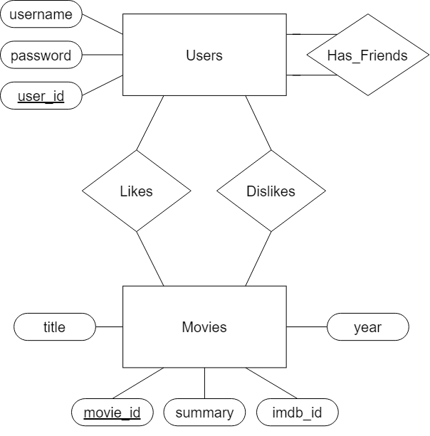

# MovieTinder

## What is this?
This is MovieTinder, you create an a account, login in, at the homepage movies will be represented to you and you can like or dislike them. In the top action bar you can see your liked movies under 'Likes', you can add or remove friends (other accounts created on you local machine) under 'Friends', change your account details under 'Account', logout and see which movies both you and your friends like under 'Matches'. This should hopefully make it easier to pick a movie with your friend or partner whenever you don't know what to watch!

The E/R diagram for the project is in the top directory and it is named 'MovieTinder_ER.drawio.png'. You can also see it below.



## How to run?

### Step 1 - Creating the database
Create a database called 'site'. This can be done using pgAdmin. 

### Step 2 - Changning the path
Change the path in the file schema.sql to where you have stored movies_shaved.csv on your local machine (the FULL PATH). The file movies_shaved.csv is a cut down version of the full dataset movies.csv. Both of these files can be found in the folder 'static'. 

### Step 3 - Setting up the database
To create all the needed tables run the following command in terminal:
```
psql -d site -U {user} -W -f schema.sql
```
Make sure to be inside the folder inner most MovieTinder folder. 

To use the example accounts we have made run the following command in terminal:
```
 psql -d site -U postgres -W -f .\schema_ins.sql
 ```
 While still inside the innermost MovieTinder folder.

### Step 3
Change the password and/or the user for the psql command under '\_\_init\_\_.py' to your own personal password. 

### Step 4 
Run the following command in terminal in the same directory as the 'run.py':
```
python run.py
```
The app should now run! If not refer step 1, 2 and 3.

## What to do with MovieTinder
We have created 3 users 'Holger69', 'MIkkel420' and 'Laust42' with the password: '123'. Each user have liked 15 movies and disliked 10 movies. 

## User stories:
Login to 'Holger69' and add 'Laust42' as a friend and see under 'Matches' which movies they both like.

Login to 'Mikkel420' and remove 'Holger69' as a friend under 'Friends'

Login in to 'Holger69' and remove the like under 'Likes' from "The Dark Knight", and check that it is no longer under 'Matches' with 'Mikkel420'

Create your own account and have a look around!
